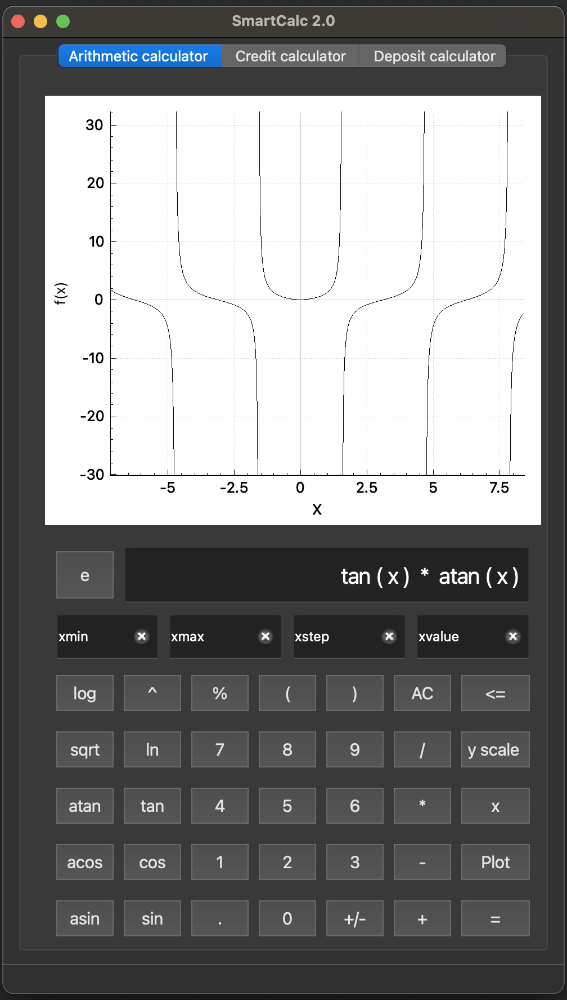

# SmartCalc_v2.0
Calculator with the function of drawing charts and calculating loans and deposits

Model-view-controller (MVC) pattern implemented

The program may not display correctly on Linux systems with interface scaling enabled. 
Set the interface scale to 100%. 

*** Installation *** 

 - make install
 - default installation folder - src/build
 
*** Usage ***

3 modes of the calculator are implemented:
 - engineering calculator for calculations and graphing
 - loan payment calculator
 - deposit calculator

*** Deletion ***

 - make uninstall

*** Requirements ***

 - C++ 17, Qt6, CMake;
