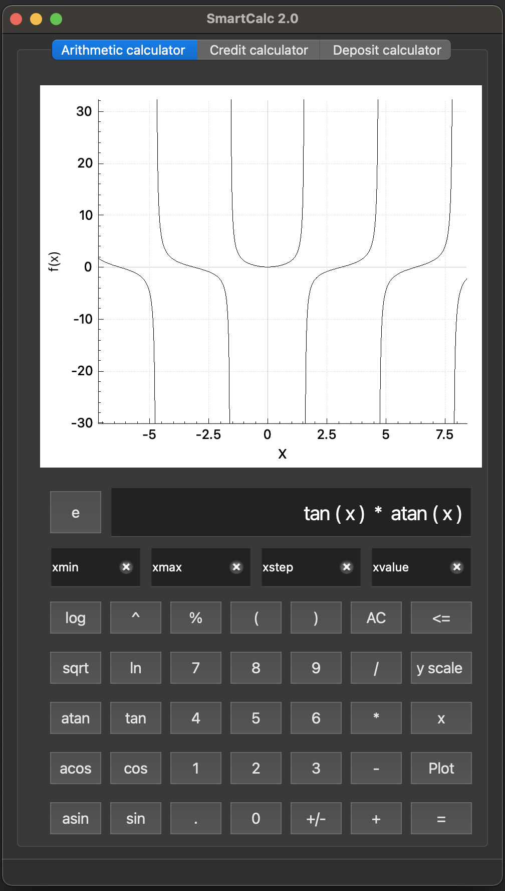

# SmartCalc_v2.0
Калькулятор с функцией построения графиков и расчета кредитов и депозитов

Реализован паттерн Model–view–controller (MVC)

*** Установка *** 
 
 - make install
 - папка для установки по умолчанию - Build
 
*** Использование ***

Реализовано 3 режима работы калькулятора:
 - инженерный калькулятор для расчетов и построения графиков
 - калькулятор платежей по кредиту
 - депозитный калькулятор

*** Удаление ***

 - make uninstall

*** Требования ***

 - C++ 17, Qt6, CMake;
